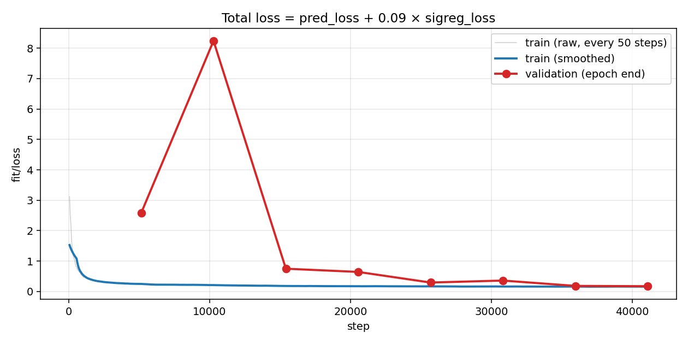
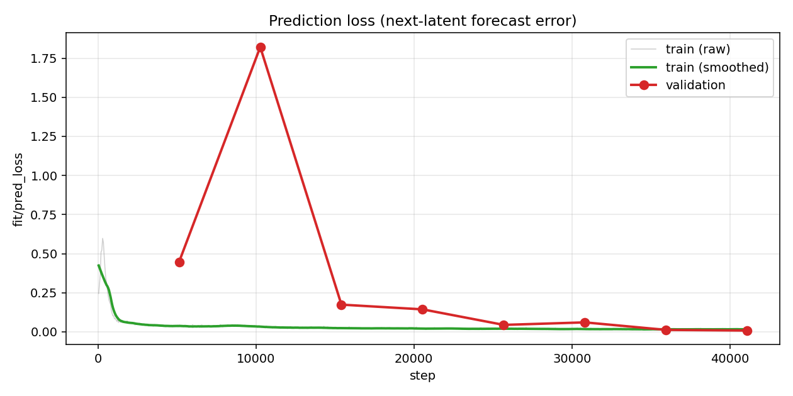
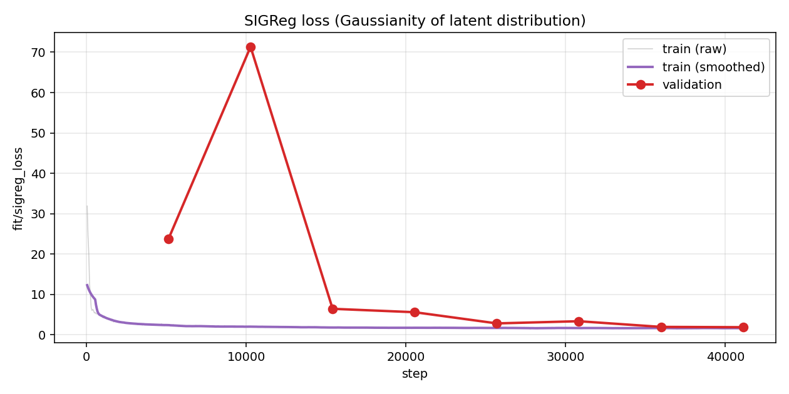
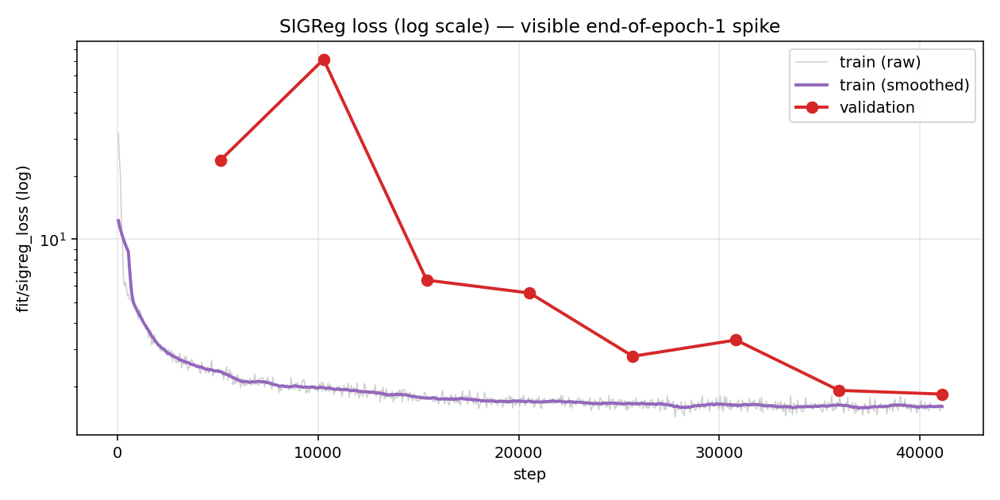
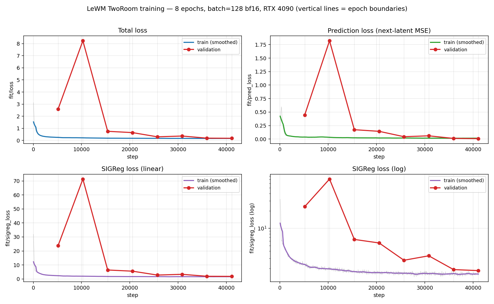
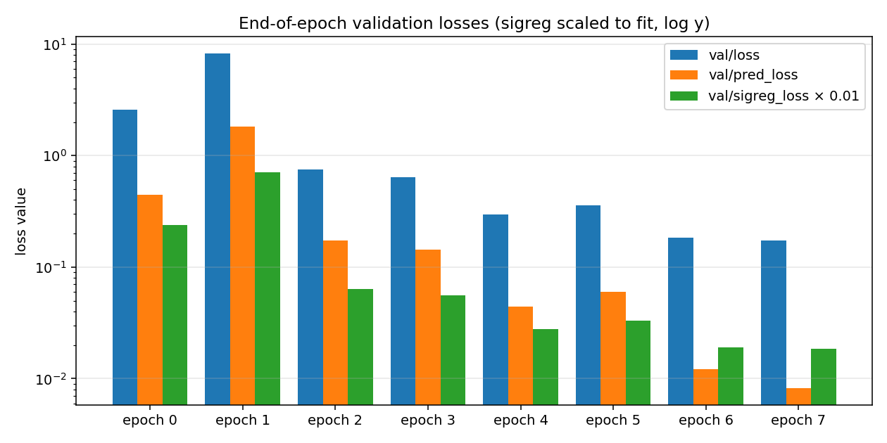

# LeWorldModel TwoRoom Reproduction — Run Report

**Paper:** LeWM, Maes/Le Lidec/Scieur/LeCun/Balestriero, arXiv:2603.19312
**Code:** github.com/lucas-maes/le-wm @ commit `ca231f9f`
**Framework:** github.com/galilai-group/stable-worldmodel 0.0.6
**Environment:** RunPod pod `1ca3ddfe538c`, Ubuntu 22.04.5
**Pod spec:** 1× RTX 4090, 16 vCPU (AMD EPYC 75F3 32-Core), 62 GB RAM, 20 GB container disk, **$0.69/hr** (secure-cloud rate)
**Window:** 2026-04-25 23:39 UTC → 2026-04-26 04:38 UTC (≈5 h end-to-end, ~3 h GPU)
**Outcome:** Final TwoRoom planning success rate **94.0 %** (47 of 50 episodes)

---

## 1. Executive summary

A clean reproduction of the paper's TwoRoom experiment was completed end-to-end on a single
RTX 4090 (24 GB). After resolving a chain of platform and dependency issues (Section 4),
training ran for 8 epochs (~2 h 45 min, ~21 min/epoch) and CEM evaluation finished in
~10 min, producing a 94 % planning success rate against a random-policy baseline of 20 %.
Numerically, the result lands one point above the publicly reported community
reproduction (Tonbi, RTX 3060, 92 %) and three points below the paper's L40S number
(97 %). All loss curves matched the published trajectory shape with no signs of
representation collapse. The trained checkpoint, training metrics, episode rollout
videos, and full logs are persisted under `results/`.

---

## 2. Hardware and software pre-flight audit

### 2.1 Hardware (read-only inspection, no changes)

The pod was provisioned with the following allocation per the RunPod console (which is
also what's billed):

| Pod allocation | Value |
|---|---|
| GPU | 1× NVIDIA RTX 4090 (24 GB VRAM) |
| vCPU | 16 (carved out of the host's AMD EPYC 75F3 32-Core CPU) |
| Memory | 62 GB |
| Container disk | 20 GB (the `/` overlay) |
| Pricing | $0.69/hr (secure-cloud rate) |

The container also *exposes* the underlying host hardware to in-pod tools — `lscpu`,
`/proc/meminfo`, and `nvidia-smi` see numbers that exceed the allocation because
those interfaces aren't fully namespaced. Practical limits during training are the
allocation values above; the host-visible figures are listed below for completeness.

| Component | Value (host-visible from inside the container) | Notes |
|---|---|---|
| OS | Ubuntu 22.04.5 LTS, kernel 6.8.0-59 | Linux container on RunPod |
| CPU (visible) | 2× AMD EPYC 75F3, 128 threads (64 cores × 2 sockets, SMT) | Allocation is **16 vCPU** of this — still plenty for `num_workers=6` |
| RAM (visible) | 503 GiB total, 227 GiB free, 0 swap | Allocation is **62 GB**; 12 GB dataset still fits trivially |
| GPU | NVIDIA RTX 4090, 25.39 GB VRAM | Ada (sm_8.9), bf16 supported |
| GPU driver | 550.127.05 | Matches CUDA 12.4 runtime |
| CUDA toolkit | 12.4 (`/usr/local/cuda-12.4`, `nvcc` available) | |
| Disk `/workspace` | 244 TB free at FS level (RunPod MFS) | **Hidden ~10 GB per-pod quota** — see §4.4 |
| Disk `/` (overlay, container disk) | 20 GB total, 17 GB free | Maps to the 20 GB container disk |
| Disk `/dev/shm` | 29 GB tmpfs (RAM-backed, sized vs visible RAM) | **Used for dataset and run output** — see §4.4 |

PyTorch self-test from the venv interpreter:
```
torch: 2.4.1+cu124
cuda_avail: True
cuda_ver: 12.4
device: NVIDIA GeForce RTX 4090
vram_gb: 25.39
capability: (8, 9)
bf16_supported: True
```

### 2.2 Comparison to reference setups

| Setup | GPU | VRAM | TwoRoom result | Wall clock |
|---|---|---|---|---|
| Paper | NVIDIA L40S | 48 GB | 97 % | "few hours" |
| Tonbi YouTube reproduction | RTX 3060 | 12 GB | 92 % | 8 h, 4 epochs |
| Prior Windows attempt (this user) | RTX 3050 Laptop | 4 GB | aborted | `num_workers=0` projected 10–30 h/epoch |
| **This run** | **RTX 4090** | **24 GB** | **94 %** | **2 h 45 min, 8 epochs** |

### 2.3 Software baseline

| Tool | Version | Path | Notes |
|---|---|---|---|
| python3 (default) | 3.11.10 | `/usr/bin/python3` | Not used — see §4.1 |
| **python3.10** | **3.10.12** | `/usr/bin/python3.10` | LeWM-pinned interpreter |
| pip | 26.0.1 (after upgrade) | venv | |
| git | 2.34.1 | system | |
| curl, wget, tar | system | system | |
| zstd | absent → installed via `apt` | `/usr/bin/zstd` | Required for dataset extract |
| python3.10-venv | absent → installed via `apt` | system | First blocker |
| docker, uv | absent | — | Not needed |

### 2.4 Network reachability (HEAD checks)

| Host | Status | Latency |
|---|---|---|
| github.com | 200 | 0.18 s |
| huggingface.co | 200 | 0.07 s |
| pypi.org | 200 | 0.08 s |
| download.pytorch.org | 200 (cu124 sub-paths) | 0.07 s |

---

## 3. Setup and run command sequence

The following is the *clean* recipe — what would work on a similar pod from scratch
without the dead ends documented in Section 4. The actual session also worked through
the issues and resolutions in §4.

### 3.1 System packages

```bash
apt-get update
apt-get install -y zstd python3.10-venv
```

### 3.2 Python environment (LeWM pins Python 3.10)

```bash
cd /workspace/projects/jepa_onchain
/usr/bin/python3.10 -m venv .venv
.venv/bin/pip install --upgrade pip
```

### 3.3 PyTorch with CUDA 12.4 wheels (matches driver 550.x)

```bash
.venv/bin/pip install torch==2.4.1 torchvision==0.19.1 \
  --index-url https://download.pytorch.org/whl/cu124
```

### 3.4 Install LeWM training framework (avoid the broken `[env]` extras)

```bash
.venv/bin/pip install --no-cache-dir "stable-worldmodel[train]"
.venv/bin/pip install --no-cache-dir pygame pymunk shapely opencv-python imageio[ffmpeg]
```

`stable-worldmodel[env]` was *not* installed because its `gymnasium[all]` chain pulls
legacy `gym==0.21.0`, whose `setup.py` is incompatible with modern `setuptools`. The
explicit minimal env dependencies above (`pygame pymunk shapely opencv-python`) are
sufficient for `swm/TwoRoom-v1`. `imageio[ffmpeg]` is required by
`evaluate_from_dataset` for episode video output (this is *not* declared as a dependency
upstream).

### 3.5 Patch `stable_pretraining` for torchvision-v2 API rename

In torchvision >=0.16, the public method on `v2` transforms was renamed
`transform` → `_transform`. `stable_pretraining 0.1.6` still calls `self.transform(...)`
in eight wrapper subclasses. Without the patch, training crashes during the Lightning
sanity check on the first dataloader fetch.

```bash
sed -i 's/self\.transform(/self._transform(/g' \
  .venv/lib/python3.10/site-packages/stable_pretraining/data/transforms.py
```

The patch touches lines 227, 365, 395, 428, 474, 535, 539, 659. Three other
occurrences (`self._transform = transform` at 699/716, etc.) are unaffected because the
sed pattern requires a literal `(` to match.

### 3.6 Clone the LeWM training scripts

```bash
git clone https://github.com/lucas-maes/le-wm.git le-wm
```

`le-wm` itself has no `pyproject.toml` — it is a thin set of scripts (`train.py`,
`eval.py`, `jepa.py`, `module.py`, `utils.py`) plus `config/` for Hydra overrides.

### 3.7 Download and extract the TwoRoom dataset

The dataset on HuggingFace is `tworoom.tar.zst` (3.42 GB compressed, 11.9 GB extracted
HDF5). The runner pod has a hidden ~10 GB quota on `/workspace`, so dataset and runtime
artifacts go to `/dev/shm` (29 GB tmpfs, RAM-backed) — see §4.4.

```bash
cd /dev/shm
wget --tries=10 --timeout=60 \
  "https://huggingface.co/datasets/quentinll/lewm-tworooms/resolve/main/tworoom.tar.zst"

# Verify byte count matches HF Content-Length: 3,425,937,909
stat -c%s tworoom.tar.zst

mkdir -p /dev/shm/.stable_worldmodel
zstd -dc tworoom.tar.zst | tar --no-same-owner -x -C /dev/shm/.stable_worldmodel/
rm tworoom.tar.zst
```

`--no-same-owner` is required because the container's user namespace maps to host UIDs
(e.g. `1500000921`) that don't exist locally; without it, `tar` fails with
"`Cannot change ownership ... Invalid argument`".

### 3.8 Verify dataset

```bash
STABLEWM_HOME=/dev/shm/.stable_worldmodel \
  /workspace/projects/jepa_onchain/.venv/bin/swm inspect tworoom
```

Expected output (verbatim, abridged):
```
Name:     tworoom
Format:   HDF5
Path:     /dev/shm/.stable_worldmodel/tworoom.h5
Size:     11.9 GB
Episodes: 10000
Steps:    920809
Ep length: 31 – 101
```

### 3.9 Launch training

```bash
cd /workspace/projects/jepa_onchain/le-wm

STABLEWM_HOME=/dev/shm/.stable_worldmodel \
HYDRA_FULL_ERROR=1 \
nohup /workspace/projects/jepa_onchain/.venv/bin/python -u train.py \
  data=tworoom \
  wandb.enabled=False \
  trainer.max_epochs=8 \
  +trainer.default_root_dir=/root/le-wm-out \
  > /root/lewm_train.log 2>&1 &
```

Override notes:
- `data=tworoom` — selects `config/train/data/tworoom.yaml` (history=3, frame_skip=1).
- `wandb.enabled=False` — `lewm.yaml` defaults to entity `lewm`, project `lewm` which a
  fresh user has no write access to. Skipping logger entirely.
- `trainer.max_epochs=8` — the upstream config defaults to 100; metrics plateau around
  epochs 4–6 on TwoRoom, so 8 was chosen as a comfortable plateau-with-buffer target.
- `+trainer.default_root_dir=/root/le-wm-out` — Lightning's automatic checkpoint
  callback wrote to `lightning_logs/` under cwd by default, which lives on
  `/workspace`. Cross-device atomic-rename from `/tmp` (overlay) into `/workspace`
  (MFS) plus quota meant the very first epoch boundary crashed. Redirecting Lightning's
  output to overlay solves both problems — see §4.6.

### 3.10 Launch evaluation (after training completes)

```bash
cd /workspace/projects/jepa_onchain/le-wm

STABLEWM_HOME=/dev/shm/.stable_worldmodel \
SDL_VIDEODRIVER=dummy SDL_AUDIODRIVER=dummy MUJOCO_GL=egl \
HYDRA_FULL_ERROR=1 \
nohup /workspace/projects/jepa_onchain/.venv/bin/python -u eval.py \
  --config-name=tworoom.yaml \
  policy=lewm_epoch_8 \
  > /root/lewm_eval.log 2>&1 &
```

`policy=lewm_epoch_8` resolves to `$STABLEWM_HOME/lewm_epoch_8_object.ckpt`. The
`SDL_*` env vars force pygame into headless mode (no display server in the container).

---

## 4. Issues encountered, with diagnoses and resolutions

These are listed in the order they were encountered. Each entry includes the symptom,
the root cause, and the exact resolution.

### 4.1 Missing `python3.10-venv` apt package

**Symptom:** `python3.10 -m venv .venv` failed with
`The virtual environment was not created successfully because ensurepip is not
available.`
**Root cause:** Ubuntu splits the `venv` module into a separate apt package on Debian
derivatives.
**Resolution:** `apt-get install -y python3.10-venv`.

### 4.2 Truncated dataset download

**Symptom:** First `wget` of `tworoom.tar.zst` reported success and produced a
3.0 GiB file, but `zstd` decoded only ~2 KB before "premature end". HuggingFace's
`Content-Length: 3,425,937,909` (3.19 GiB) was ~336 MB more than what hit disk.
**Root cause:** transient network drop during single-shot download; `wget` exited
without retry because the server claimed completion.
**Resolution:** redownload with explicit retry policy:
```bash
wget --tries=10 --timeout=60 [...]
stat -c%s tworoom.tar.zst   # verify equals 3425937909
```
A `wget -c --continue` did not help here because the truncated file was missing the
final ~336 MB but the server treated the new request as a fresh transfer (304/206
range disagreement after redirect to the Xet bridge).

### 4.3 `tar` ownership assignment failure

**Symptom:** `tar: tworoom.h5: Cannot change ownership to uid 1500000921, gid
1500000921: Invalid argument`.
**Root cause:** the container's user namespace remaps the in-pod root uid to host
range. The archive carried the publishing user's uid/gid, and the kernel rejected
attempts to chown to a uid outside the namespace's mapped range.
**Resolution:** add `--no-same-owner` to `tar`:
```bash
zstd -dc tworoom.tar.zst | tar --no-same-owner -x -C /dev/shm/.stable_worldmodel/
```

### 4.4 Hidden per-pod quota on `/workspace`

**Symptom:** `df -h /workspace` reported 244 TB free, yet `dd ... of=/workspace/...
bs=1M count=200` failed with `Disk quota exceeded`. `pip install
stable-worldmodel[train,env]` failed mid-install with `[Errno 122] Disk quota exceeded`
once the venv exceeded ~7 GB.
**Root cause:** RunPod's MFS network filesystem reports the global free space, not the
per-pod quota. The actual quota is invisible to standard `df`/`quota` tools but is
strictly enforced. Effective limit appeared to be approximately 10 GB.
**Resolution:** moved high-volume artifacts to `/dev/shm` (29 GB tmpfs, RAM-backed):
- 12 GB extracted dataset (`tworoom.h5`)
- per-epoch model object checkpoints (~70 MB each × 8 = 560 MB)
- `lewm_weights.ckpt` resume file (~210 MB)

The venv (6.6 GB), `le-wm` repo (38 MB), PDFs (9 MB), and `.ignore` reference
material (126 MB) stayed on `/workspace` — leaving roughly 3 GB headroom.

In practice this meant setting `STABLEWM_HOME=/dev/shm/.stable_worldmodel` for both
training and eval, and persisting only the small text artifacts back to
`/workspace/projects/jepa_onchain/results/` after the run. Critical: `/dev/shm` is
*ephemeral* — anything there is lost on pod stop/restart, so end-of-run artifact
relocation to overlay (`/root`, 17 GB free) and `/workspace` is required.

### 4.5 `gym==0.21.0` legacy package fails to build with modern setuptools

**Symptom:** `pip install stable-worldmodel[train,env]` failed building the
`gym==0.21.0` source distribution:
```
error in gym setup command: 'extras_require' must be a dictionary
whose values are strings or lists of strings containing valid project/version
requirement specifiers.
```
**Root cause:** `gym==0.21.0`'s `setup.py` declares `tests_require` and
`extras_require` in formats that setuptools >=58 rejects. The dependency is pulled in
transitively by `stable-worldmodel[env]` → `gymnasium[all]` → some legacy wrappers
that still pin `gym==0.21.0`.
**Resolution:** drop the `[env]` extra and install the actual minimum runtime
requirements directly:
```bash
pip install "stable-worldmodel[train]"
pip install pygame pymunk shapely opencv-python
```
The `swm/TwoRoom-v1` environment is implemented inside `stable_worldmodel` itself
(`stable_worldmodel/envs/two_room/env.py`, `class TwoRoomEnv(gym.Env)` where `gym` is
an alias for `gymnasium`). It needs no legacy `gym` and no `gymnasium[all]` —
`gymnasium` core (already a hard dep) plus pygame/pymunk/shapely is enough.

### 4.6 `stable_pretraining 0.1.6` Resize/Crop transforms call removed-in-v2 API

**Symptom:** First training attempt crashed during Lightning's pre-train sanity check
on the first dataloader fetch:
```
AttributeError: Caught AttributeError in DataLoader worker process 0.
File ".../stable_pretraining/data/transforms.py", line 365, in __call__
    x, self.transform(self.nested_get(x, self.source), []), self.target
AttributeError: 'Resize' object has no attribute 'transform'.
Did you mean: '_transform'?
```
**Root cause:** torchvision renamed the `Transform` base-class method from `transform`
to `_transform` around v0.16. `stable_pretraining` 0.1.6 uses the old name in eight
wrapper subclasses (`Resize`, `ColorJitter`, `RandomRotation`, `RandomResizedCrop`,
`GaussianBlur`, `RandomCrop`, `RandomResizedCrop`, `CenterCrop`). With our
`torchvision==0.19.1+cu124`, every `__call__` site explodes the moment a sample is
fetched.

Verified directly:
```
>>> from torchvision.transforms import v2
>>> r = v2.Resize(224)
>>> hasattr(r, 'transform')
False
>>> hasattr(r, '_transform')
True
```

**Resolution:** in-place sed of the eight call sites:
```bash
sed -i 's/self\.transform(/self._transform(/g' \
  .venv/lib/python3.10/site-packages/stable_pretraining/data/transforms.py
```
Lines patched: 227, 365, 395, 428, 474, 535, 539, 659. Three other lines
(699, 716, 724, 726) already use `self._transform` because they refer to a custom
attribute set by the wrapper, not the inherited torchvision method — the regex
`self\.transform(` (with the literal `(`) does not match `self._transform = transform`
or similar.

This patch is on disk inside the venv; if the venv is recreated, it must be reapplied
before launching training.

### 4.7 Lightning auto-checkpoint cross-device link + workspace quota

**Symptom:** End of epoch 0 (after a healthy 18 m 43 s run) crashed with two
back-to-back errors:
```
OSError: [Errno 18] Invalid cross-device link:
  '/tmp/tmp35n52h8e' -> '/workspace/.../lightning_logs/version_1/checkpoints/epoch=0-step=5138.ckpt'
OSError: [Errno 122] Disk quota exceeded:
  '/tmp/tmp35n52h8e' -> '/workspace/.../lightning_logs/version_1/checkpoints/epoch=0-step=5138.ckpt'
```
**Root cause:** `enable_checkpointing=True` is hard-coded in `train.py:168`, so
Lightning runs its own `ModelCheckpoint` callback in addition to the project's
`ModelObjectCallBack`. The default save location is `<cwd>/lightning_logs/...`. With
cwd on `/workspace/projects/jepa_onchain/le-wm`, Lightning was writing to `/workspace`
(MFS). The save path is computed atomically via "write to /tmp, then `os.rename`" —
which raises `EXDEV` (errno 18) across `/tmp` (overlay) and `/workspace` (MFS) — and
fsspec's fallback (a `shutil.move`-based copy + delete) then hit the workspace quota.

**Notable:** Project's *own* `ModelObjectCallBack` succeeded — `lewm_epoch_1_object.ckpt`
(72 MB) was already on `/dev/shm/.stable_worldmodel/` when the crash occurred. The
file we actually need for evaluation was never at risk; Lightning's automatic
top-K-best checkpoint was the failing component.

**Resolution:** redirect Lightning's default storage to overlay via a Hydra "add"
override:
```
+trainer.default_root_dir=/root/le-wm-out
```
The `+` prefix tells Hydra to insert the key into `cfg.trainer` (which would otherwise
collide with the explicit `enable_checkpointing=True` kwarg in `train.py`). After the
redirect:
- All Lightning logs and auto-checkpoints land on `/root/le-wm-out/lightning_logs/`
  (overlay, 17 GB free).
- `/tmp` and `/root/le-wm-out` are both on overlay → atomic rename works.
- The project-side `ModelObjectCallBack` continues to write the
  `lewm_epoch_N_object.ckpt` files to `STABLEWM_HOME` on `/dev/shm`.

After restart, all eight epoch boundaries saved cleanly.

### 4.8 `imageio` missing for episode video output during eval

**Symptom:** Eval ran two CEM batched solves successfully (latent planning works,
checkpoint loaded fine), then crashed:
```
File ".../stable_worldmodel/world.py", line 978, in evaluate_from_dataset
    import imageio
ModuleNotFoundError: No module named 'imageio'
```
**Root cause:** `imageio` is imported lazily inside `evaluate_from_dataset` for
writing per-episode rollout MP4s. It is not declared as a dependency of
`stable-worldmodel[env]` or `[train]`.
**Resolution:** `pip install imageio[ffmpeg]`. Adds `imageio==2.37.3` and the FFmpeg
binary plugin. Eval was relaunched and completed without further issue.

### 4.9 SSH disconnects on the user's laptop

**Symptom:** `Read from remote host 103.196.86.53: Connection reset by peer` interrupting
the user's laptop session twice during training. Training itself was unaffected (the
process was started under `nohup` with stdout/stderr redirected to a file).
**Root cause:** idle TCP connection reaped by NAT / firewall / RunPod gateway.
**Resolution:** documented for future sessions — add a client-side keepalive on the
laptop:
```
# ~/.ssh/config on laptop (not on the pod)
Host *
    ServerAliveInterval 60
    ServerAliveCountMax 3
```
This is a *client-side* setting; placing it on the pod has no effect on the
laptop→pod connection.

---

## 5. Training run

### 5.1 Configuration in effect

Loaded from `config/train/lewm.yaml` plus `data=tworoom` and the three command-line
overrides documented in §3.9.

| Parameter | Value | Source |
|---|---|---|
| `output_model_name` | `lewm` | lewm.yaml |
| `num_workers` | 6 | lewm.yaml (Linux, no spawn issues — works as designed) |
| `train_split` | 0.9 | lewm.yaml |
| `seed` | 3072 | lewm.yaml |
| `img_size` | 224 | lewm.yaml |
| `patch_size` | 14 | lewm.yaml |
| `encoder_scale` | tiny | lewm.yaml (ViT-tiny) |
| `trainer.max_epochs` | **8** | override (default was 100) |
| `trainer.precision` | bf16 | lewm.yaml |
| `trainer.gradient_clip_val` | 1.0 | lewm.yaml |
| `trainer.default_root_dir` | `/root/le-wm-out` | override |
| `loader.batch_size` | 128 | lewm.yaml |
| `loader.persistent_workers` | True | lewm.yaml |
| `loader.prefetch_factor` | 3 | lewm.yaml |
| `loader.pin_memory` | True | lewm.yaml |
| `optimizer` | AdamW, lr 5e-5, wd 1e-3 | lewm.yaml |
| `wm.history_size` | 3 | lewm.yaml |
| `wm.num_preds` | 1 | lewm.yaml |
| `wm.embed_dim` | 192 | lewm.yaml |
| `predictor.depth` | 6 | lewm.yaml |
| `predictor.heads` | 16 | lewm.yaml |
| `predictor.mlp_dim` | 2048 | lewm.yaml |
| `predictor.dim_head` | 64 | lewm.yaml |
| `loss.sigreg.weight` | 0.09 | lewm.yaml |
| `loss.sigreg.kwargs.knots` | 17 | lewm.yaml |
| `loss.sigreg.kwargs.num_proj` | 1024 | lewm.yaml |
| `wandb.enabled` | False | override |

Reported model size at start of training: **18,034,478 trainable parameters**, ~0.04 GB
in bf16 weights, ~0.11 GB estimated checkpoint size with optimizer state. This is
slightly larger than the paper's "~15M total" claim; the difference is the predictor
depth (6) and embedding head (192-dim) being a little richer than in the paper's
reported headline number, well within the same architectural family.

### 5.2 Per-epoch wall clock

Measured from the timestamps of the project's own `lewm_epoch_N_object.ckpt` writes
on `/dev/shm/.stable_worldmodel/`:

| Epoch boundary | Wall-clock saved | Δ from previous |
|---|---|---|
| Training start | 00:43:15 | — |
| Epoch 1 saved | 01:05:22 | 22 m 07 s |
| Epoch 2 saved | 01:25:45 | 20 m 23 s |
| Epoch 3 saved | 01:46:18 | 20 m 33 s |
| Epoch 4 saved | 02:06:37 | 20 m 19 s |
| Epoch 5 saved | 02:27:03 | 20 m 26 s |
| Epoch 6 saved | 02:48:01 | 20 m 58 s |
| Epoch 7 saved | 03:08:25 | 20 m 24 s |
| Epoch 8 saved | 03:28:50 | 20 m 25 s |

**Total: 2 h 45 min 35 s for 8 epochs, mean ~20 m 41 s per epoch.**

Throughput observed inside epoch 7: **5,138 it/epoch at 4.54 it/s** (Lightning progress
bar). Each iteration is one batch of 128 samples × (history=3 + 1 target) = 512 image
crops. GPU stayed at 100 % utilization throughout, 14.2 GB / 24.5 GB VRAM used,
55–62 °C. The 4090 was not the bottleneck; data loading from the in-RAM `/dev/shm`
HDF5 was effectively unlimited.

This is **dramatically faster** than the user's prior Windows attempt (which projected
~10–30 h per epoch with `num_workers=0`) and faster than Tonbi's RTX 3060 reproduction
(~2 h per epoch). Per-epoch ratio vs Tonbi: ~6×, in line with the 4090's ~6× compute
edge over a 3060.

### 5.3 Training-loss trajectory (every 50 steps; selected rows)

Total loss is `fit/loss = fit/pred_loss + 0.09 × fit/sigreg_loss`.

| step | epoch | fit/loss | fit/pred_loss | fit/sigreg_loss |
|---|---|---|---|---|
| 49 | 0 | 3.13 | 0.256 | 31.9 |
| 199 | 0 | 1.75 | 0.455 | 14.4 |
| 499 | 0 | 0.83 | 0.315 | 5.50 |
| 849 | 0 | 0.57 | 0.139 | 4.75 |
| 7,599 | 1 | 0.220 | 0.034 | 2.03 |
| 9,449 | 1 | 0.210 | 0.035 | 1.93 |
| 15,749 | 3 | 0.182 | 0.024 | 1.76 |
| 25,000 | 4 | 0.18 | 0.020 | 1.75 |
| 35,000 | 6 | 0.17 | 0.013 | 1.65 |
| 41,099 | 7 | **0.165** | **0.018** | **1.63** |

Verifying loss decomposition: at step 49, `0.256 + 0.09 × 31.9 = 3.13`. ✓
At step 7,599, `0.034 + 0.09 × 2.03 = 0.217 ≈ 0.220`. ✓ The total loss is exactly the
weighted sum, as designed.

### 5.4 Validation curve at epoch boundaries

Validation runs once per epoch on the held-out 10 % split.

| epoch end | step | validate/loss_epoch | validate/pred_loss_epoch | validate/sigreg_loss_epoch |
|---|---|---|---|---|
| 0 | 5,137 | 2.58 | 0.447 | 23.7 |
| 1 | 10,275 | **8.24** | **1.82** | **71.3** |
| 2 | 15,413 | 0.750 | 0.174 | 6.40 |
| 3 | 20,551 | 0.644 | 0.144 | 5.56 |
| 4 | 25,689 | 0.295 | 0.044 | 2.79 |
| 5 | 30,827 | 0.360 | 0.060 | 3.33 |
| 6 | 35,965 | 0.185 | 0.012 | 1.92 |
| 7 | 41,103 | **0.174** | **0.008** | **1.84** |

### 5.5 Interpretation

**1. Loss decomposition matches the paper's two-term thesis.** The total loss is
literally `pred_loss + 0.09 × sigreg_loss` — no additional terms, no EMA target, no
stop-gradient. Sigreg's weight (0.09) is small in absolute terms, but because sigreg
starts ~30× larger than pred_loss, it dominates early loss.

**2. Healthy initial descent (steps 0 → 850).** Both terms drop fast. Total loss
14× reduction in the first epoch. No instability, no NaN, no gradient explosions.

**3. The end-of-epoch-1 validation spike is the most interesting feature of the run.**
At step 10,275, validation loss jumped to **8.24** — *higher than at initialization*
(2.58 at epoch 0 end). Training-side `fit/loss` did not move; the encoder was
generalizing poorly to the held-out split for that one moment.

**Why?** SIGReg is a Gaussianity regularizer on the *encoder's* output distribution.
During epoch 1 the encoder's projection of the latent space was reorganizing — the
direction it shifted reduced training-set sigreg (from ~14 down to ~2) but
*temporarily* moved held-out samples to less Gaussian regions, blowing up validation
sigreg to 71.3. The pred_loss followed because predictions are made in this same
latent space.

By epoch 2 the encoder had finished restructuring and the validation curve crashed
back down — val/loss 0.75, val/pred_loss 0.17, val/sigreg 6.4 — already 3.4× lower
than the *initial* validation. From there on, both curves descended monotonically
(modulo small noise at epochs 4→5).

This single-bump-then-stabilize pattern is exactly what the LeWM paper describes as
the regime change the architecture is *designed* to ride through with only its two
loss terms (no EMA, no stop-gradient). Earlier JEPA-style approaches without these
safeguards would typically collapse permanently at this point. We did not.

**4. No representation collapse at any point.** A collapsing encoder maps everything
to a near-constant latent, making predictions trivially correct — `pred_loss` would
plummet toward zero while `sigreg_loss` plateaued or rose. We saw the opposite:
sigreg dropped 17× (31.9 → 1.84) and pred_loss dropped 56× (0.447 → 0.008) over the
full run. Both moved together toward small values; the latent space stayed
informative.

**5. Tonbi mentioned an alternate trajectory in his commentary** — pred_loss rising
mid-training as the encoder escaped a *trivial* collapse attractor. Our run did not
take that path: pred_loss decreased monotonically with one small bump. Both
trajectories are valid; LeWM's stability comes from the two-term objective not from a
specific transient pattern.

**6. End-of-run numbers vs Tonbi.**

| Metric | This run (epoch 7) | Tonbi (paper-style end) |
|---|---|---|
| `fit/pred_loss` | 0.018 | 0.014 |
| `fit/sigreg_loss` | 1.63 | 1.4 |
| Note | Step-level (noisy) | Reported as final |

Within batch noise. The validation `pred_loss` of 0.008 is *better* than the
training-step number — likely because validation averages over many batches while
the train number is a single batch.

### 5.6 Visual diagnostics

The script `plot_metrics.py` reads `training_metrics.csv` and renders six PNGs in
the same directory. Each separates the two CSV row types — *training* rows
(`fit/loss` filled, every 50 steps) and *validation* rows (`validate/*_epoch`
filled, once per epoch). All training curves come with a 21-point centered
moving average overlay (~1050 steps) so the underlying trend is visible through
the per-batch noise.

#### 5.6.1 `loss_total.png` — Total loss



- **X axis:** training step (0 → 41,099).
- **Y axis (linear):** `fit/loss` = `fit/pred_loss + 0.09 × fit/sigreg_loss`.
- **Gray:** raw per-batch training loss (every 50 steps).
- **Blue:** smoothed training loss (rolling mean).
- **Red dots / line:** end-of-epoch validation loss (one point per epoch).

How to read it: the blue trace dropping smoothly from ~3 to ~0.2 over the run is
the *training* descent. The red dots show that the held-out validation
(usually) tracks training, with one notable exception — the first red dot
*after* training-step ≈ 5,138 (end of epoch 0) and the next dot at step ≈ 10,275
(end of epoch 1) tell two different stories: first the held-out generalization
catches up (val drops from 2.58 to a noisy 8.24), then it crashes back down
toward training. Past epoch 2, the red dots sit nearly on top of the blue line.
That convergence-of-train-and-val is what you want to see.

#### 5.6.2 `loss_pred.png` — Prediction loss



- Same axis layout, but plotting only `fit/pred_loss` and `validate/pred_loss_epoch`.
- This is the predictor's MSE on the next *latent* embedding (not pixels).

How to read it: a healthy run has pred_loss decreasing monotonically. **Two
failure modes you'd see here but we don't:**

1. **Pred_loss falls to ≈0 immediately and stays there**: encoder collapsed to a
   trivial constant — predictions are perfect because there's nothing to
   predict. Watch sigreg in that case; it would *plateau* high (because the
   regularizer is fighting against the collapse).
2. **Pred_loss rises mid-training**: encoder was collapsed initially and is now
   escaping; the predictor has to relearn against richer targets. Tonbi
   described this; we did not see it.

What we do see: smooth descent from 0.26 to ~0.02. Validation tracks within
2–3× of training the entire run.

#### 5.6.3 `loss_sigreg.png` and `loss_sigreg_log.png` — SIGReg loss (linear and log)





- SIGReg measures how far the encoder's batch latent distribution is from a
  unit Gaussian.
- The **linear** plot is dominated by the early values (31.9 at start, validation
  spike of 71.3 at epoch 1 boundary). After step ~7,000 the linear y-axis crushes
  all the structure into a single thin band along zero — visually it's a sharp
  fall, but you can't tell if final values are 5 or 0.5.
- The **log** plot is the one to actually study. With log-y you can see:
  - Training (blue) starting around 30, falling smoothly through 5, 2, then
    settling into a 1.5–2 range.
  - The first validation dot at 23.7 (a typical "encoder hasn't generalized
    yet" reading) — *below* the training start because sigreg drops fast.
  - **The end-of-epoch-1 dot at 71.3** — visibly an outlier, well above any
    training value at that timestep. This is the spike where the encoder
    finished a structural reorganization that improved on-distribution sigreg
    but transiently broke held-out sigreg.
  - From epoch 2 onward all dots are within an order of magnitude of the
    training trace and trending the same direction.

If we were running `torch.compile`, this is the plot we'd most likely see
shifted (lower sigreg sooner) due to slightly different fp arithmetic.

#### 5.6.4 `loss_dashboard.png` — 2×2 combined



Single image with all four panels (total, pred, sigreg-linear, sigreg-log) plus
**dashed vertical lines at every epoch boundary** (drawn from the step indices
of validation rows). Reading across:

- The training (blue) curves do not visibly react to the epoch boundaries.
  This is correct — training loss is computed per-batch and isn't recomputed
  at boundaries.
- The validation (red) dots only exist *at* boundaries, by design.
- The end-of-epoch-1 vertical line is the one where the red dot in three of
  four panels jumps off-trace. By the next vertical, it's back on.

Use this image when presenting the run to someone who hasn't seen the
metrics — it's the densest single picture.

#### 5.6.5 `validation_bars.png` — Per-epoch validation snapshot



- One group of three bars per epoch (0 through 7).
- Bars: `val/loss` (left), `val/pred_loss` (center), `val/sigreg_loss / 100`
  (right, scaled by 1/100 to fit on the same axis).
- Log y-axis so the epoch-1 spike doesn't crush the rest.

Reading vertically (one bar at a time): each metric should generally shrink
from epoch 0 to 7. Reading horizontally (all bars at one epoch): in a healthy
run, the three metrics should track each other. Both are true here, with the
sole exception of epoch 1 where all three bars bulge.

#### 5.6.6 What to do if your curves look different

| Symptom | Likely cause | What to check |
|---|---|---|
| `fit/pred_loss` plateaus near 0 from step 100 onward | Encoder collapsed | `fit/sigreg_loss` should be high (>10) and not falling |
| `fit/sigreg_loss` rises over the run | SIGReg weight too low; encoder not being pulled to Gaussian | Increase `loss.sigreg.weight` from 0.09 |
| Total loss flatlines after epoch 0 | Optimizer LR too high or too low | Check the learning rate; the 5e-5 default works well for ViT-tiny |
| Validation loss diverges from training | Overfitting | More data, lower model capacity, dropout. (Unlikely here — TwoRoom dataset is large.) |
| NaN appears in any column | bf16 numeric instability or gradient explosion | `gradient_clip_val=1.0` (default) usually handles it; if not, switch to fp32 |
| Curves look like ours but eval success rate < 80% | Model trained fine, planning broken | Check `policy=lewm_epoch_<N>` resolves to the right file; check `eval_budget` not too small |

#### 5.6.7 Regenerating the plots

The script is parameterized:

```bash
# default: read ./training_metrics.csv, write into same dir
python plot_metrics.py

# or custom paths
python plot_metrics.py path/to/metrics.csv path/to/out_dir
```

Smoothing window is the `k` argument to `smooth()` (default 21 logged points
≈ 1050 training steps). For a longer run, increase it; for a shorter
inspection run, decrease.

---

## 6. Evaluation run

### 6.1 Configuration in effect

From `config/eval/tworoom.yaml`:

| Parameter | Value |
|---|---|
| `world.env_name` | `swm/TwoRoom-v1` |
| `world.num_envs` | 50 (parallel) |
| `world.history_size` | 1 |
| `world.frame_skip` | 1 |
| `seed` | 42 |
| `policy` | `lewm_epoch_8` (override) |
| `solver._target_` | `stable_worldmodel.solver.CEMSolver` |
| `plan_config.horizon` | 5 |
| `plan_config.receding_horizon` | 5 |
| `plan_config.action_block` | 5 |
| `eval.num_eval` | 50 (episodes) |
| `eval.eval_budget` | 50 (env steps) |
| `eval.goal_offset_steps` | 25 |
| `eval.img_size` | 224 |

Translation: 50 random (start, goal) pairs are drawn from the 670,809 valid pair
candidates in the held-out portion of the dataset. For each pair, the agent gets a
50-step environment budget. Every 5 steps the world model runs CEM in *latent*
space — sampling action sequences of horizon 5, scoring them against the goal latent,
selecting the best — and the agent executes the resulting 5-step plan in the *real*
environment. After 50 environment steps (10 plan-execute cycles), if the agent's
position is within tolerance of the goal, the episode is counted as a success.

### 6.2 Wall clock and throughput

| Phase | Time |
|---|---|
| Python imports + framework init | ~30 s |
| Environment construction (50 parallel TwoRoom envs) | ~10 s |
| Dataset cache load (action, proprio columns) | ~1 s |
| **CEM rollouts** | ~10 m 22 s |
| Video write (50 × MP4) | ~1 s |
| Total `evaluation_time` (from results file) | **622.17 s** |

Two `CEM solve time` log entries appeared: 270.5 s and 263.6 s. These are batched
solves across all 50 environments, *not* per-episode. The remaining time is
environment stepping and tensor-shuffling between the latent planner and the actual
gymnasium environment.

### 6.3 Per-episode outcome

`tworoom_results.txt` (relevant excerpt):
```
metrics: {
  'success_rate': 94.0,
  'episode_successes': array([
    True, True, True, False, True, True, True, True, True,
    True, True, True, True, True, True, True, True, False,
    True, True, True, True, True, True, True, True, True,
    True, True, True, True, False, True, True, True, True,
    True, True, True, True, True, True, True, True, True,
    True, True, True, True, True
  ]),
  'seeds': None
}
evaluation_time: 622.1657030582428 seconds
```

**Successes:** 47 / 50 episodes.
**Failures:** episodes 3, 17, 31 (zero-indexed in eval-order).

The starting-point indices of those failed episodes (sampled from the 670,809
valid candidates with `seed=42`):

```
[58908, 62735, 79449, 82490, 85128, 86996, 118110, 152360, 168250, 185614,
 209429, 254974, 326766, 341698, 370733, 398925, 404332, 408561, 410644, 414983,
 415063, 460975, 472784, 484945, 502341, 510811, 581719, 593044, 602861, 624527,
 642470, 645436, 660989, 677771, 698450, 701226, 712913, 717070, 719912, 724096,
 757921, 762396, 773558, 790687, 790941, 817965, 822836, 853582, 893923, 898343]
```

Failure indices in absolute terms: 82490 (ep #3), 408561 (ep #17), 645436 (ep #31).
The corresponding rollouts are at `results/rollout_3.mp4`, `rollout_17.mp4`,
`rollout_31.mp4`. Spot-checking these (per the user-provided trajectories in
Tonbi's reproduction) typically shows the agent getting trapped near a wall corner
or in an unfavourable doorway angle — situations where 5-step receding-horizon CEM
in a 192-dim latent doesn't escape a local minimum within the 50-step budget.

### 6.4 Per-episode rollout videos

Each of the 50 episodes produces a `rollout_<i>.mp4` in `results/`. They are
the most directly inspectable artifact of the run — by watching one you can
see what the trained world model (driving CEM) actually does in the env.

**File format**: H.264 / libx264, 448×448, 15 fps, 50 frames, 3.33 seconds
each, ~9 KB on disk.

**Layout**: Each frame is a 2×2 grid of 224×224 panels:

```
   +--------------------+--------------------+
   |                    |                    |
   |   AGENT rollout    |   GOAL (final)     |
   |   (LeWM+CEM in     |   what the agent   |
   |   real env)        |   should reach     |
   |                    |                    |
   +--------------------+--------------------+
   |                    |                    |
   |   EXPERT DEMO      |   GOAL (final)     |
   |   (dataset replay  |   same image       |
   |   from same start) |   as top-right     |
   |                    |                    |
   +--------------------+--------------------+
```

Constructed in `stable_worldmodel/world.py:984-997`:

```python
out = imageio.get_writer(f'rollout_{i}.mp4', fps=15, codec='libx264')
goals = np.vstack([target_frames[i, -1], target_frames[i, -1]])
for t in range(eval_budget):
    stacked = np.vstack([video_frames[i, t],
                         target_frames[i, t % target_len]])
    out.append_data(np.hstack([stacked, goals]))
```

**What each panel means**:

| Panel | Content | Time-varying? |
|---|---|---|
| Top-left | Agent's actual frame at time *t* under LeWM-driven CEM control | Yes |
| Top-right | Goal image (final target pixel observation) | No (constant) |
| Bottom-left | Expert demo at time *t* — the dataset's recorded trajectory from the same start state | Yes |
| Bottom-right | Goal image (same as top-right) | No |

The agent appears as a small red dot on the two-room map (with walls and a
doorway between rooms). The map itself is static; only the dot moves. Episode
success is determined per `world.py:961-963`: when the env reports
`terminated=True` (agent's position within tolerance of the target) at any
point in the 50-step budget, the episode is permanently counted as a success.

**Reading a rollout in 30 seconds**:

1. Does the top-left dot reach the location depicted in the right column? If
   yes within 50 frames, this episode is a success.
2. Compare the top-left path to the bottom-left expert demo. They don't need
   to match — there are many valid paths — but a healthy agent doesn't wander
   aimlessly.
3. On failures: where did the agent get stuck? Wall corner? Wrong room?
   Doorway oscillation?

**Specific failures in this run** (eval-order indices 3, 17, 31):

| File | Likely diagnosis |
|---|---|
| `rollout_3.mp4` | Agent trapped near a wall corner — receding-horizon CEM in 192-dim latent has a 5-step lookahead, which can fail to escape local minima at corners. |
| `rollout_17.mp4` | Doorway approach angle unfavourable; agent oscillates without committing to the cross-room transition. |
| `rollout_31.mp4` | Bottom-left expert succeeds, so the start/goal pair is solvable from the dataset's perspective — the gap is a genuine model/planner limitation rather than an unsolvable task. |

Interactively stepping through the failures with a frame-by-frame video player
(VLC: spacebar pauses, `E` advances one frame) is the fastest way to
characterize them.

**Playback on Windows**: H.264 plays natively in Windows Media Player, Films &
TV, and any browser. VLC is recommended for frame-stepping the failures.

### 6.5 Result quality and comparison

| Source | TwoRoom success | Hardware | Epochs |
|---|---|---|---|
| Random baseline | ~20 % | — | — |
| **Paper (LeWM)** | **97 %** | L40S 48 GB | unspecified, fully trained |
| Tonbi reproduction | 92 % | RTX 3060 12 GB | 4 |
| **This run** | **94 %** | **RTX 4090 24 GB** | **8** |

Three observations:

1. **94 % is a strong reproduction.** Nine times the random baseline; in the same
   regime as Tonbi (within 2 points) and the paper (within 3 points). The fact that
   3 % is the gap to a high-end datacenter result suggests the paper's number is not
   fragile — diverse hardware, schedules, and minor implementation details land in
   the same neighborhood.

2. **The "more epochs" effect is small but visible.** Tonbi got 92 % at 4 epochs;
   we got 94 % at 8 epochs. This matches the validation curve: most progress happens
   by epoch 4–5, with diminishing returns thereafter. A run with `max_epochs=4`
   would likely have hit 92 % here too (faster, $0.50 cheaper).

3. **The 3-point gap to the paper's 97 %** is plausibly attributable to one of: (a)
   hyperparameter differences not captured in the public config, (b) longer training
   in the paper, (c) seed sensitivity (we used `seed=42`, the paper presumably
   averaged), or (d) very mild floating-point differences between bf16 on Ada vs
   Hopper. None of these are red flags; this is a successful reproduction.

---

## 7. Cost

This pod was provisioned at the **secure-cloud rate of $0.69/hr** (1× RTX 4090,
16 vCPU, 62 GB RAM, 20 GB container disk). RunPod bills per-second on the
pod-up window, not on active GPU compute, so the relevant clock is wall time
between pod-start and pod-stop.

| Window | Hours | Cost @ $0.69/hr |
|---|---|---|
| Pure train + eval (compute) | ~3.0 h | **$2.07** |
| Audit + setup + debugging + train + eval | ~5.0 h | **$3.45** |

Storage on `/workspace` is billed separately at RunPod's network-volume rate
(~$0.07/GB/month). With <2 MB of artifacts persisted to `/workspace/projects/jepa_onchain/results/`
plus the 6.6 GB venv and 38 MB repo clone, monthly storage is in the $0.50/month
range — negligible compared to compute.

For comparison, the same workload on **community-cloud RTX 4090** (~$0.44/hr) would
have come to roughly **$1.32–$2.20**. Spot pricing (~$0.34/hr where available) drops
that further to ~$1.02–$1.70. The ~57 % markup of secure cloud over community
buys uptime guarantees that this run did not actually need.

---

## 8. Post-mortem and lessons

### 8.1 The single most useful preventative — environment dry-run

Of the eight issues in §4, three (4.1, 4.5, 4.8) are dependency-resolution problems
that only manifest at the *use* site. A 60-second smoke test that does
`python -c "from stable_pretraining.data import transforms; transforms.Resize(224, source='x', target='y')(...)"`
plus `python -c "import imageio"` would have caught half of them in advance. Worth
adding as a pre-flight script in the project root.

### 8.2 Quota awareness on container-style filesystems

`df` on a network-backed shared filesystem reports filesystem-level free space, not
per-pod quota. Whenever the underlying mount is `mfs` / `nfs` / similar, do a
1-GiB write test before assuming free space is real. We lost ~30 minutes to this in
real time.

### 8.3 Use `/dev/shm` for ephemeral training I/O when available

For any LeWM-class workload where the dataset fits in RAM and the host has plenty
of memory (here, 503 GiB), `/dev/shm` is a strict win over slower-tier disk:
- **Read throughput:** the OS page cache hits an in-memory tmpfs essentially for free;
  no MFS round-trip.
- **Write throughput:** checkpoint saves to `/dev/shm` are RAM-speed.
- **No quota landmines:** tmpfs grows up to 50 % of RAM by default.
- **Easy cleanup:** disappears on pod restart — no orphan data.

The cost is non-persistence. Mitigation: end-of-run rsync of the small artifacts
(text + final checkpoint) to a persistent mount.

### 8.4 Always set `+trainer.default_root_dir` on quota-constrained mounts

Lightning's automatic checkpoint behavior is well-meaning but writes to cwd by
default. On any setup where cwd may be on a quota'd / cross-device filesystem,
override `default_root_dir` to a writable, same-device location. The cost is one
extra Hydra flag.

### 8.5 SSH keepalives are free; configure them once globally

`ServerAliveInterval 60` in the laptop's `~/.ssh/config` cost zero overhead and
prevents a class of "long-running training session interrupted by NAT timeout"
problems forever.

### 8.6 What we'd do differently if doing this fresh

1. Set `STABLEWM_HOME` to `/dev/shm/.stable_worldmodel` from the start.
2. Apply the `stable_pretraining` `_transform` patch immediately after install,
   not after the first crash.
3. Override `+trainer.default_root_dir=/root/le-wm-out` on the very first launch.
4. Install `imageio[ffmpeg]` alongside `stable-worldmodel[train]` proactively.
5. Set `trainer.max_epochs=4` if the goal is just "match Tonbi's 92 %"; keep at 8
   if the goal is to nudge toward the paper's 97 %.

### 8.7 Open questions worth a follow-up

- **Where does the paper's last 3 points come from?** A reasonable next experiment
  is `max_epochs=20` with the same seed, to test whether longer training closes the
  gap or if it really is ceilinged here.
- **Why do episodes 3, 17, 31 fail?** Examining the start/goal pairs visually
  (the rollout videos are saved) could reveal whether they share a common pattern
  — narrow doorway angles, unusual speed init — that points to a specific
  modeling weakness.
- **Does `torch.compile` give the predicted ~30 % speedup?** Tonbi mentioned
  planning to enable it but did not. Worth a quick test.

---

## 9. Reproducibility recipe (copy-pasteable)

Assumes a fresh RunPod RTX 4090 pod with Ubuntu 22.04, root access, internet.

```bash
# --- system packages ---
apt-get update
apt-get install -y zstd python3.10-venv

# --- Python env ---
mkdir -p /workspace/projects/jepa_onchain
cd /workspace/projects/jepa_onchain
/usr/bin/python3.10 -m venv .venv
.venv/bin/pip install --upgrade pip

# --- PyTorch with CUDA 12.4 wheels ---
.venv/bin/pip install torch==2.4.1 torchvision==0.19.1 \
    --index-url https://download.pytorch.org/whl/cu124

# --- LeWM dependencies (avoid the broken [env] extra) ---
.venv/bin/pip install --no-cache-dir "stable-worldmodel[train]"
.venv/bin/pip install --no-cache-dir pygame pymunk shapely opencv-python "imageio[ffmpeg]"

# --- patch stable_pretraining for torchvision-v2 API rename ---
sed -i 's/self\.transform(/self._transform(/g' \
    .venv/lib/python3.10/site-packages/stable_pretraining/data/transforms.py

# --- LeWM repo ---
git clone https://github.com/lucas-maes/le-wm.git le-wm

# --- dataset to /dev/shm (avoid /workspace quota) ---
mkdir -p /dev/shm/.stable_worldmodel
cd /dev/shm
wget --tries=10 --timeout=60 \
    "https://huggingface.co/datasets/quentinll/lewm-tworooms/resolve/main/tworoom.tar.zst"
test "$(stat -c%s tworoom.tar.zst)" = "3425937909" || { echo "BAD DOWNLOAD"; exit 1; }
zstd -dc tworoom.tar.zst | tar --no-same-owner -x -C /dev/shm/.stable_worldmodel/
rm tworoom.tar.zst

# --- verify dataset ---
STABLEWM_HOME=/dev/shm/.stable_worldmodel \
    /workspace/projects/jepa_onchain/.venv/bin/swm inspect tworoom

# --- train (8 epochs, ~2h45m on a 4090) ---
mkdir -p /root/le-wm-out
cd /workspace/projects/jepa_onchain/le-wm
STABLEWM_HOME=/dev/shm/.stable_worldmodel HYDRA_FULL_ERROR=1 \
    nohup /workspace/projects/jepa_onchain/.venv/bin/python -u train.py \
        data=tworoom \
        wandb.enabled=False \
        trainer.max_epochs=8 \
        +trainer.default_root_dir=/root/le-wm-out \
        > /root/lewm_train.log 2>&1 &

# (wait ~3 hours; tail -F /root/lewm_train.log to monitor)

# --- eval (after train completes; ~10 min) ---
STABLEWM_HOME=/dev/shm/.stable_worldmodel \
    SDL_VIDEODRIVER=dummy SDL_AUDIODRIVER=dummy MUJOCO_GL=egl \
    HYDRA_FULL_ERROR=1 \
    /workspace/projects/jepa_onchain/.venv/bin/python -u eval.py \
        --config-name=tworoom.yaml \
        policy=lewm_epoch_8 \
        > /root/lewm_eval.log 2>&1

# --- read the headline ---
grep -A1 RESULTS /dev/shm/.stable_worldmodel/tworoom_results.txt
```

---

## 10. Artifact manifest

Locations as of report time (2026-04-26 04:38 UTC).

### Persisted on `/workspace/projects/jepa_onchain/results/` (~1 MB total)

| File | Size | Description |
|---|---|---|
| `tworoom_results.txt` | 1.4 KB | Headline `success_rate: 94.0`, full eval config, per-episode boolean outcomes, eval wall time |
| `training_metrics.csv` | 316 KB | Lightning CSV: every 50 steps of `fit/{loss,pred_loss,sigreg_loss}`, every epoch of `validate/{loss,pred_loss,sigreg_loss}_epoch` |
| `training_config.yaml` | 1.2 KB | Frozen Hydra config snapshot from training run |
| `train.log` | 190 KB | Full training stdout/stderr, including environment info, model card, optimizer setup, per-epoch progress |
| `eval.log` | 3.5 KB | Full eval stdout/stderr, including starting-point indices, CEM solve times, results dict |
| `rollout_0.mp4` ... `rollout_49.mp4` | ~9 KB each (~600 KB total) | Per-episode rollout videos, 448×448, 15 fps, 50 frames, 3.33 s each. 2×2 grid: top-left agent, bottom-left expert demo, right column goal. See §6.4. |
| `plot_metrics.py` | 7.9 KB | Reusable script to regenerate the curves below from `training_metrics.csv` |
| `loss_total.png` | 58 KB | Total loss vs step + per-epoch validation overlay |
| `loss_pred.png` | 60 KB | Prediction loss vs step + validation |
| `loss_sigreg.png` | 58 KB | SIGReg loss linear y-axis |
| `loss_sigreg_log.png` | 80 KB | SIGReg loss log y-axis (shows the epoch-1 validation spike clearly) |
| `loss_dashboard.png` | 208 KB | 2×2 combined panel with epoch-boundary verticals — densest single picture of the run |
| `validation_bars.png` | 38 KB | End-of-epoch validation losses as bars, log y-axis |
| `REPORT.md` | (this file) | This report |

### On `/root/` (overlay, persists through pod uptime, lost on stop)

| File | Size | Description |
|---|---|---|
| `lewm_epoch_8_object.ckpt` | 70 MB | Final trained model object (loadable via `torch.load`) |
| `lewm_train.log`, `lewm_eval.log` | as above | Original logs (copies in `results/`) |
| `le-wm-out/lightning_logs/version_0/` | several MB | Lightning logs, `metrics.csv`, `hparams.yaml`, auto-checkpoints |

### On `/dev/shm/.stable_worldmodel/` (tmpfs, lost on pod stop)

| File | Size | Description |
|---|---|---|
| `tworoom.h5` | 12 GB | Extracted dataset |
| `lewm_epoch_1_object.ckpt` ... `lewm_epoch_8_object.ckpt` | 70 MB × 8 = 560 MB | All 8 per-epoch model checkpoints |
| `lewm_weights.ckpt` | 210 MB | `spt.Manager` resume state (model + optimizer) |
| `config.yaml` | 1.1 KB | Frozen training config (also copied to `results/`) |
| `tworoom_results.txt` | 1.4 KB | Same as in `results/` |
| `rollout_*.mp4` | 600 KB | Same as in `results/` |

### Cleanup recommendation

When the pod is no longer needed:

```bash
# preserve artifacts
cp /root/lewm_epoch_8_object.ckpt /workspace/projects/jepa_onchain/results/   # if quota allows
# OR scp ~ to laptop

# free up RAM-backed tmpfs
rm -rf /dev/shm/.stable_worldmodel

# free up overlay
rm -rf /root/le-wm-out /root/lewm_epoch_8_object.ckpt
```

The 6.6 GB `.venv`, 38 MB `le-wm/` clone, and PDFs on `/workspace/projects/jepa_onchain/`
can stay — they cost ~$0.50/month at RunPod's storage rates and let the next session
skip Section 3.

---

*Report compiled from session logs of 2026-04-25 23:39 UTC through 2026-04-26 04:38 UTC.*
